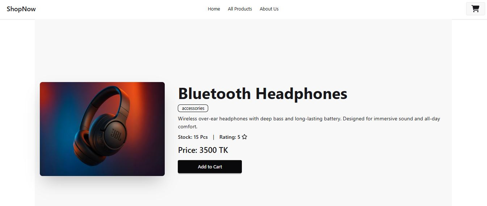
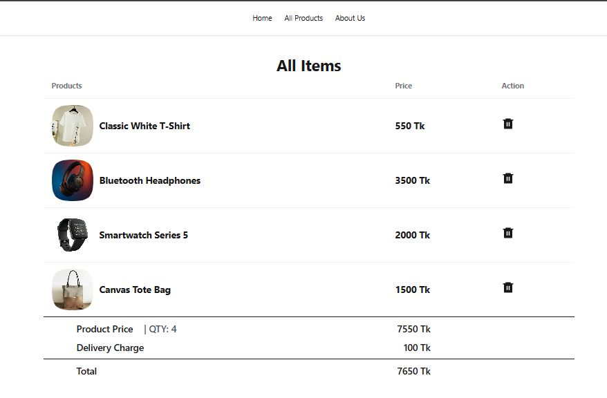
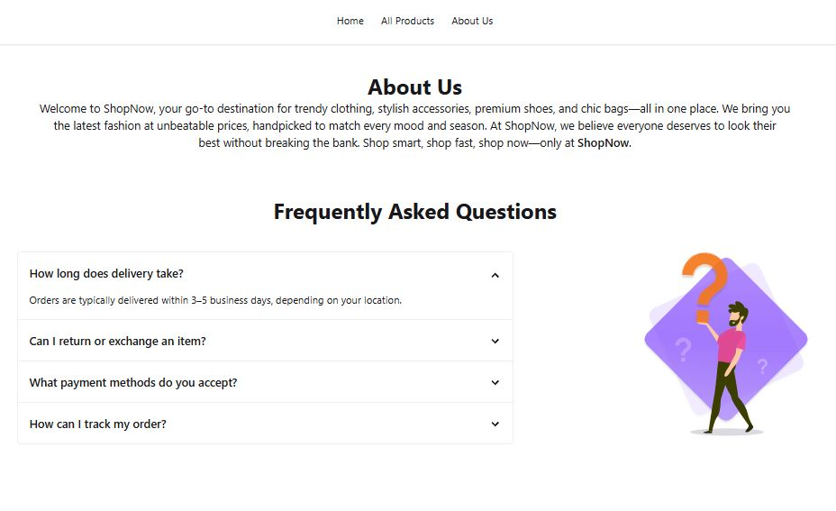

# 🛍️ ShopNow

**ShopNow** is a modern and responsive e-commerce website that allows users to browse a wide range of products, including clothing, bags, shoes, and accessories. With core features like a shopping cart, adding/removing products, and a clean user interface, it's a perfect demo of an online shopping experience.

## 🔗 Live Site

👉 [Visit ShopNow](https://shop-now-gray.vercel.app/)

## 📂 GitHub Repository

🔗 [GitHub - Shifat507/shop-now](https://github.com/Shifat507/shop-now)

---

## ✨ Features

- ✅ Display all available products
- 🛒 Add products to the shopping cart
- ❌ Remove products from the cart
- 📦 Categories include clothing, bags, shoes, accessories
- 💻 Clean and responsive design

---

## 📸 Screenshots

### 🏠 Homepage


### 📦 All Products


### 📋 Product Details


### 🛒 Cart Page


### ℹ️ About Us Page



---

## 🚀 Technologies Used

- **React.js** – Frontend framework
- **JavaScript (ES6+)** – Scripting
- **HTML5 & CSS3** – Markup & styling
- **Tailwind CSS** – Utility-first CSS framework
- **Vercel** – Hosting & deployment

---

## 🛠️ Setup & Run Locally

```bash
# Clone the repository
git clone https://github.com/Shifat507/shop-now.git

# Navigate into the project directory
cd shop-now

# Install dependencies
npm install

# Run the development server
npm run dev
